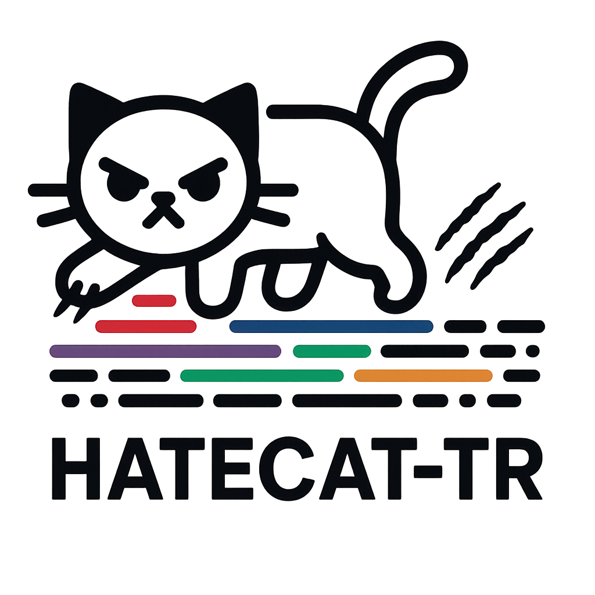

<p align="center">
  
</p>

# HATECAT-TR: Hate Speech Span Detection in Turkish Tweets
Hate speech on social media in Turkey remains a critical issue, frequently targeting minority groups. Effective moderation requires not only detecting hateful posts but also identifying the specific hateful expressions within them.

We introduce HATECAT-TR, a span-annotated dataset of Turkish tweets, containing 4,465 hateful spans across 2,981 posts, each directed at one of eight minority groups. Annotations were created using a semi-automated approach, combining GPT-4o–generated spans with expert human review to ensure accuracy.

Each hateful span is categorized into one of five discourse types, enabling fine-grained analysis of the nature and intent behind hateful content. We frame span detection as both binary and multi-class token classification tasks, and provide baseline experiments with state-of-the-art language models.

Our findings highlight the challenges of detecting and categorizing implicit hate speech, particularly when spans are subtle and highly contextual.

- Dataset: Not publicly distributed (see [Data Access](#data-access)).  

## Installation 

```bash
pip install -r requirements.txt
```


## Repository Structure  

- **`notebooks/auto-labeling.ipynb`** – GPT-4o–based auto-labeling workflow.  
- **`train.py`** – Training script for span detection, supporting:  
  - **Categorization** (detect & categorize hateful spans).  
  - **Detection** (binary detection of hateful spans).  


## How to Run

⚠️ Note: Due to platform terms and ethical considerations, the dataset itself is not distributed with this repository. The commands below are illustrative. If you prepare your own data in the required format, you can use the scripts as shown.

**Data Format**: The CSV files must include the following fields: `tokens`, `tags`, `Tweet_id`


### Detection

```bash
python train.py \
  --task detection \
  --train_set ./train_annotations/train_set_no_category.csv \
  --test_set ./test_annotations/test_set_no_category.csv \
  --non_hateful ./non_hateful/nonhateful_tweets_with_tags_no_category.csv \
  --test_sample_size 300 \
  --random_state 42 \
  --model_name dbmdz/bert-base-turkish-cased \
  --learning_rate 5e-5 \
  --batch_size 4 \
  --epochs 10 \
  --warmup_ratio 0.1 \
  --early_stop_patience 3 \
  --weight_decay 0.0 \
  --eval_train_split_ratio 0.1 \
  --log_steps 100
```

### Categorization

```bash
python train.py \
  --task categorization \
  --train_set ./train_annotations/train_set.csv \
  --test_set ./test_annotations/test_set.csv \
  --non_hateful ./non_hateful/nonhateful_tweets_with_tags.csv \
  --test_sample_size 300 \
  --random_state 42 \
  --model_name dbmdz/bert-base-turkish-cased \
  --learning_rate 5e-5 \
  --batch_size 4 \
  --epochs 10 \
  --warmup_ratio 0.1 \
  --early_stop_patience 3 \
  --weight_decay 0.0 \
  --eval_train_split_ratio 0.1 \
  --log_steps 100
```


## Data Access

The HATECAT-TR dataset cannot be shared publicly due to X (Twitter) platform terms.
Researchers interested in collaborations or data access for academic purposes may contact the authors directly.

## Citation

If you use HATECAT-TR in your research, please cite our paper:

```bibtex
@inproceedings{seker2025hatecat,
  title        = {{HATECAT-TR}: Span-Annotated Hate Speech Dataset for Turkish Social Media},
  author       = {Şeker, Hasan Kerem and Uludoğan, Gökçe and Önal, Pelin and Özgür, Arzucan},
  booktitle    = {Findings of the Association for Computational Linguistics: EMNLP 2025},
  year         = {2025}
}
```


